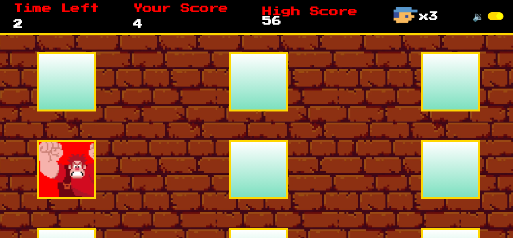

# Whac-a-Ralph 
Whac-a-Ralph is a fast-paced, browser-based arcade game inspired by the classic Whac-A-Mole, but featuring **Ralph** from **Wreck-It Ralph**. 
Prevent Ralph from wracking the building by smashing him with your mighty hammer.

Originally based on a DIO (Digital Innovation One) project, this version extends the core gameplay with additional features, animations, and UX improvements.

  

Features include:

- Retro-style design and sound effects

- Smooth animations and a playful squeaky hammer cursor

- High score tracking using local storage

- Sound toggle with memory persistence

- Game board is dynamically rendered on each play

- Cursor changes to a toy hammer only during active gameplay

- Game-over screen with animated pop-in text box

- Backdrop disables gameplay interaction after time runs out

- A responsive game board rendered dynamically on each play

Sound toggle for customizable gameplay experience

Test your reflexes and aim for the highest score in this nostalgic mini-game.

---

Technical Highlights
- Written in vanilla JavaScript, HTML, and CSS

- Game state managed via a structured state object (view, values, actions)

- Uses setInterval() for timed logic and enemy movement

- Relies on event delegation and DOM manipulation for interactivity

- Audio feedback implemented via the Audio() API

- Responsive UI with flexbox and CSS grid

- Custom cursor using .png images and CSS transitions

+ no dependencies — runs entirely in the browser with no setup required

---

#Feel free to mess around 
- I am planning to...

[] Add visual feedback animation when Ralph is hit

[] Dynamically change gameVelocity as the game progresses

[] Build a mobile version with responsive layout and (maybe) a drawer menu

[] organize engine and CSS into modules for readability 

👉 [Play it here](https://diolemos.github.io/Whac-A-Ralph/)
